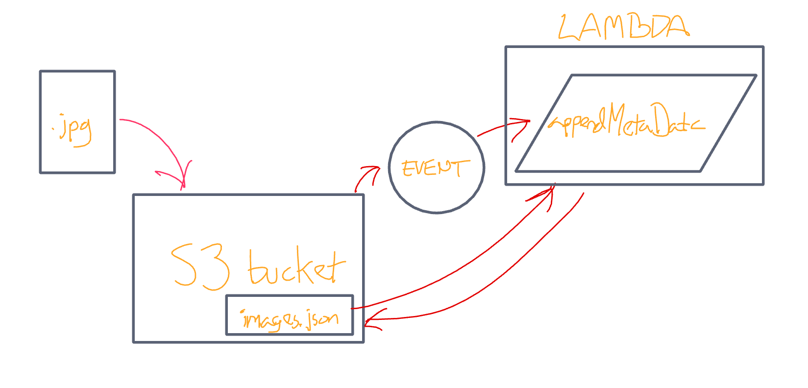

# aws-lambda-s3-action

This is a lambda function which appends data about an image uploaded to an S3 bucket to a dictionary of images in the bucket.

Test data passes, though I had difficulty getting the event to fire outside test conditions.

images.json link: https://image-post.s3.us-west-2.amazonaws.com/images.json
